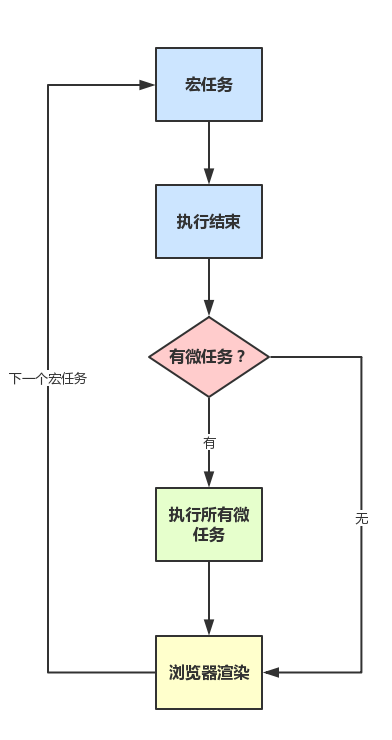

# 进程与线程
---
进程是cpu资源分配的最小单位，进程可以包含多个线程。 浏览器就是多进程的，每打开的一个浏览器窗口就是一个进程。

线程是cpu调度的最小单位，同一进程下的各个线程之间共享程序的内存空间。

可以把进程看做一个仓库，线程是可以运输的货车，每个仓库有属于自己的多辆货车为仓库服务（运货），每个仓库可以同时由多辆车同时拉货，但是每辆车同一时间只能干一件事，就是运输本次的货物。这样就好理解了吧。

## 渲染进程
浏览器包括4个进程：

1. 主进程（Browser进程），浏览器只有一个主进程，负责资源下载，界面展示等主要基础功能
2. GPU进程，负责3D图示绘制
3. 第三方插件进程，负责第三方插件处理
4. 渲染进程（Renderer进程），负责js执行，页面渲染等功能，也是本章重点内容

渲染进程主要包括GUI渲染线程、Js引擎线程、事件循环线程、定时器线程、http异步线程。

### GUI渲染线程
先看看浏览器得到一个网站资源后干了哪些事：

1. 首先浏览器会解析html代码（实际上html代码本质是字符串）转化为浏览器认识的节点，生成DOM树，也就是DOM Tree
2. 然后解析css，生成CSSOM（CSS规则树）
3. 把DOM Tree 和CSSOM结合，生成Rendering Tree(渲染树)

GUI就是来干这个事情的，如果修改了一些元素的颜色或者背景色，页面就会重绘（Repaint），如果修改元素的尺寸，页面就会回流（Reflow），当页面需要Repaing和Reflow时GUI都会执行，进行页面绘制。

这里提示一点：_Reflow比Repaint的成本更高，在js性能优化中会将如何避免Reflow和Repaint_

### JS引擎线程
js引擎线程就是js内核，负责解析与执行js代码，也称为主线程。浏览器同时只能有一个JS引擎线程在运行JS程序，所以js是单线程运行的。

需要注意的是，js引擎线程和GUI渲染线程同时只能有一个工作，js引擎线程会阻塞GUI渲染线程

```js
<html>
    <body>
        <div id="div1"> a </div>
        <script>
            document.getElementById('div1').innerHTML = 'b'
        </script>
        <div id='div2'> div2 </div>
    </body>
</html>
```
在浏览器渲染的时候遇到`<script>`标签，就会停止GUI的渲染，然后js引擎线程开始工作，执行里面的js代码，等js执行完毕，js引擎线程停止工作，GUI继续渲染下面的内容。所以如果js执行时间太长就会造成页面卡顿的情况，这也是后面性能优化的点。

### 事件循环线程
事件循环线程用来管理控制事件循环，并且管理着一个事件队列（task queue），当js执行碰到事件绑定和一些异步操作时，会把对应的事件添加到对应的线程中（比如定时器操作，便把定时器事件添加到定时器线程），等异步事件有了结果，便把他们的回调操作添加到事件队列，等待js引擎线程空闲时来处理。

### 定时器线程
由于js是单线程运行，所以不能抽出时间来计时，只能另开辟一个线程来处理定时器任务，等计时完成，把定时器要执行的操作添加到事件任务队列尾，等待js引擎线程来处理。这个线程就是定时器线程。

### 异步请求线程
当执行到一个http异步请求时，便把异步请求事件添加到异步请求线程，等收到响应（准确来说应该是http状态变化），把回调函数添加到事件队列，等待js引擎线程来执行。

## Event Loop
上面介绍了渲染进程中的5个主要的线程，可能看完上面对各个线程简单的介绍，还有点不明白他们之间到底怎么协作工作的，下面就从Event Loop的角度来聊一聊他们之间是怎样那么愉快合作的。

已经知道了js是单线程运行的，也知道js中有同步操作和异步操作。同步和异步大家应该很熟了，不多介绍。

同步操作运行在js引擎线程（主线程）上，会形成一个执行栈，而异步操作则在他们对应的异步线程上处理（比如：定时操作在定时器线程上；http请求则在异步请求线程上处理）。

而事件循环线程则监视着这些异步线程们，等异步线程们里面的操作有了结果（比如：定时器计时完成，或者http请求获取到响应），便把他们的回调函数添加到事件队列尾部，整个过程中执行栈、事件队列就构成Event Loop。

请看网络盗图：


这是网络上对Event Loop的解释图，相信大家现在能明白这张图的含义了。

## 有关定时器（setTimeout、setInterval）的更多趣事
### 定时器会按照规定时间执行吗？
定时器是规定在一段时间之后执行一段代码，但是在js执行中不会准确无误的按照预期的时间去执行定时器里面的代码。

一个原因是W3C标准规定setTimeout中最小的时间周期是4毫秒，凡是低于4ms的时间间隔都按照4ms来处理。

其实还有一个重要的原因，如果仔细看上面的文章，大家应该会想到在js执行的时候，主线程碰到定时器的时候，是不会直接处理的，应该是先把定时器事件交给定时器线程去处理，这时主线程继续执行下面的代码，同时定时器线程开始计时处理，等到计时完毕，事件循环线程会把定时器要执行的操作放在事件队列末尾，等主线程空闲的时候再来执行事件队列里面的操作。

### 应该使用setTimeout还是setInterval
使用setTimeout模拟setInterval代码类似以下代码：

```js
var say = function() {
    setTimeout(say, 1000)
    console.log('hello world')
}

setTimeout(say, 1000)
```
这样js碰到定时器，会交给定时器线程处理，然后等计时完毕，定时器里面的操作添加到事件队列，等主线程空闲去执行，主线程执行的时候又会发遇到定时器，这是又开始执行上面的一系列操作。

你会发现，这样做会在每一次定时器执行完毕才开始下一个定时器，其中的误差只是等待主线程空闲所需要等待的时间。

而setInterval是规定每隔固定的时间就往定时器线程中推入一个事件，这样做有一个问题，就是累积效应。

> 累积效应：就是如果定时器里面的代码执行所需的时间大于定时器的执行周期，就会出现累计效应，简单来说就是上一次定时器里面的操作还没执行完毕，下一次定时器事件又来了

累积效应会导致有些事件丢失，具体为什么会丢失，感兴趣的可以看这篇文章，所以为了保险起见，尽量去使用setTimeout而不使用setInterval。

如果有对setTimeout非常感兴趣的同学，我非常推荐大家去看看80% 应聘者都不及格的 JS 面试题这篇文章。

## macrotask与microtask
microtask是Promise里一个新的概念。

### macrotask（宏任务）
- macrotask中的事件都是放在一个事件队列中的，而这个队列由事件触发线程维护
- macrotask（又称之为宏任务），可以理解是每次执行栈执行的代码就是一个宏任务（包括每次从事件队列中获取一个事件回调并放到执行栈中执行）
- 每一个task会从头到尾将这个任务执行完毕，不会执行其它
- 浏览器为了能够使得JS内部task与DOM任务能够有序的执行，会在一个task执行结束后，在下一个 task 执行开始前，对页面进行重新渲染
### microtask（微任务）
- microtask（又称为微任务），可以理解是在当前 task 执行结束后立即执行的任务
- microtask中的所有微任务都是添加到微任务队列（Job Queues）中，等待当前macrotask执行完毕后执行，而这个队列由JS引擎线程维护
- 在当前task任务后，下一个task之前，在渲染之前执行

所以它的响应速度相比setTimeout（setTimeout是task）会更快，因为无需等渲染
也就是说，在某一个macrotask执行完后，就会将在它执行期间产生的所有microtask都执行完毕（在渲染前）
请看网络盗图：



所以js运行过程：

- 执行一个宏任务（栈中没有就从事件队列中获取）
- 执行过程中如果遇到微任务，就将它添加到微任务的任务队列中
- 宏任务执行完毕后，立即执行当前微任务队列中的所有微任务（依次执行）
- 当前宏任务执行完毕，开始检查渲染，然后GUI线程接管渲染
- 渲染完毕后，JS线程继续接管，开始下一个宏任务（从事件队列中获取）


有关macrotask和microtask的分析借鉴于从浏览器多进程到JS单线程，JS运行机制最全面的一次梳理